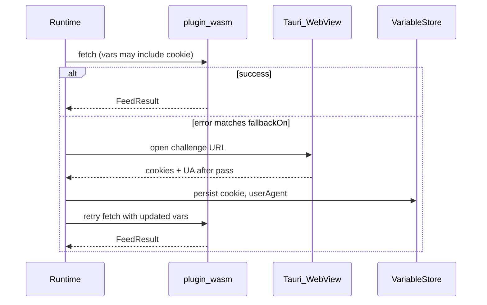
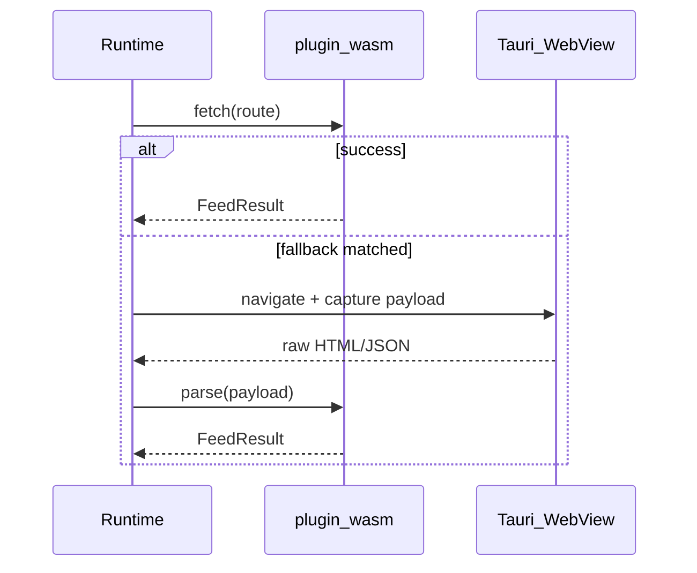

# Fetch Modes & Browser Assistance

Manifest fields that declare **how** a plugin obtains data. Validated by `manifest.wasm.schema.json`. Runtime support may roll out in phases; configs are forward-compatible.

## Overview — three fetch strategies

| Strategy | Typical use | Manifest shape |
|----------|-------------|----------------|
| **1. API / HTTP (default)** | Open APIs, unprotected HTML | `executionMode: "wasm"` |
| **2. Session-assisted API** | Cloudflare / captcha: pass challenge once, reuse Cookie for HTTP | `executionMode: "wasm"` + `browser.purpose: "session"` |
| **3. Pure browser** | Site has no usable API; extract in WebView | `executionMode: "browser"` |

Related (content pipeline, not a fourth “user strategy”):

| Mode | Use | Manifest shape |
|------|-----|----------------|
| **Hybrid parse** | Browser loads page → WASM `action: "parse"` | `executionMode: "hybrid"` (+ `browser.purpose: "fetch"`) |

```
executionMode  →  primary path (who drives the fetch)
browser.purpose →  why the WebView is opened (when browser is involved)
```

---

## `config.executionMode`

Default: `"wasm"`.

| Value | Behavior |
|-------|----------|
| `wasm` | Host HTTP + WASM `fetch`. Browser only if `config.browser` allows fallback / session assist. |
| `browser` | Tauri WebView loads the target; `orbit-bridge.js` returns feed JSON. WASM is **not** used for fetch. |
| `hybrid` | Browser obtains raw HTML/JSON; runtime calls WASM `action: "parse"` with that payload. |

---

## `config.browser`

Optional. Omit entirely when the plugin never needs a WebView.

```json
{
  "browser": {
    "purpose": "session",
    "required": false,
    "fallbackOn": ["captcha", "http_403"],
    "persist": ["cookie", "userAgent"],
    "origins": ["https://www.example.com"]
  }
}
```

### Fields

| Field | Type | Default | Description |
|-------|------|---------|-------------|
| `purpose` | enum | see below | Why the browser is opened. |
| `required` | bool | `false` | `true` → always use browser path (skip initial WASM HTTP). Official signed plugins only. |
| `fallbackOn` | string[] | `[]` | Error tokens that trigger a browser retry after WASM/host HTTP failure. Empty = never auto-fallback. |
| `persist` | string[] | `["cookie","userAgent"]` when `purpose=session`, else `[]` | Variable keys written back after a successful browser challenge / session. |
| `origins` | string[] | — | Optional allowlist of navigation origins for the WebView. |

### `purpose`

| Value | Meaning | Pairs with |
|-------|---------|------------|
| `session` | Open browser (e.g. Tauri window) to pass CF/captcha; **store Cookie / UA**; subsequent requests stay on **host HTTP + WASM**. | `executionMode: "wasm"` |
| `fetch` | Browser loads the page and returns raw HTML/JSON to the runtime (for hybrid parse or bridge). | `executionMode: "hybrid"` |
| `extract` | Browser runs extraction (`orbit-bridge.js`) and returns a complete `FeedResult`. | `executionMode: "browser"` |

**Defaults when `purpose` is omitted:**

| `executionMode` | Implied `purpose` |
|-----------------|-------------------|
| `wasm` | `session` (if `browser` block present) |
| `hybrid` | `fetch` |
| `browser` | `extract` |

Prefer setting `purpose` explicitly on new plugins.

### `fallbackOn` tokens

Canonical values (plugins should emit matching error text prefixes):

| Token | When |
|-------|------|
| `captcha` | Challenge page / bot check (error message starts with `captcha:` or body looks like CF) |
| `http_403` | HTTP 403 |
| `http_503` | HTTP 503 |
| `empty_items` | Successful HTTP but zero items |
| `timeout` | Request / page load timeout |

Plugins signal captcha to the runtime with an error such as:

```text
captcha: channel page blocked by Cloudflare
```

Runtime matches `fallbackOn` against status codes and/or the error string.

### `persist` (session mode)

After the user completes verification in the WebView, the runtime writes selected fields into the plugin’s stored variables (same keys as `config.variables`), then **retries the original WASM `fetch`** with those values in `req.vars`.

| Persist key | Typical variable | Notes |
|-------------|------------------|-------|
| `cookie` | `variables.cookie` | Includes `cf_clearance` etc.; expires |
| `userAgent` | `variables.userAgent` | Must match the browser that obtained the cookie |

Manual fill of the same variables remains supported and skips the popup when already valid.

---

## Strategy recipes

### 1. API only (default)

```json
{
  "executionMode": "wasm"
}
```

No `browser` block. Host HTTP only.

### 2. Session-assisted API (Cloudflare / captcha)

```json
{
  "executionMode": "wasm",
  "variables": {
    "cookie": {
      "label": "Cookie",
      "description": "Optional; leave empty to verify in browser when challenged",
      "required": false,
      "secret": true
    },
    "userAgent": {
      "label": "User-Agent",
      "required": false,
      "secret": false
    }
  },
  "browser": {
    "purpose": "session",
    "required": false,
    "fallbackOn": ["captcha", "http_403"],
    "persist": ["cookie", "userAgent"],
    "origins": ["https://www.example.com"]
  }
}
```

Flow:



### 3. Pure browser

```json
{
  "executionMode": "browser",
  "browser": {
    "purpose": "extract",
    "required": true,
    "origins": ["https://www.example.com"]
  }
}
```

WebView + bridge produce the feed; no WASM HTTP fetch.

### Hybrid parse (optional)

```json
{
  "executionMode": "hybrid",
  "browser": {
    "purpose": "fetch",
    "required": false,
    "fallbackOn": ["http_403", "captcha", "empty_items"]
  }
}
```



---

## Compatibility matrix

| `executionMode` | Sensible `browser.purpose` | Notes |
|-----------------|----------------------------|-------|
| `wasm` | omit / `session` | Session assist is the CF pattern (e.g. gequbao). |
| `wasm` | `fetch` / `extract` | Discouraged; use `hybrid` / `browser` instead. |
| `hybrid` | `fetch` | Browser supplies raw body; WASM parses. |
| `browser` | `extract` | Full browser extraction. |
| any | `required: true` | Forces browser path up front (official plugins). |

---

## Security gates (planned)

- `browser` / `hybrid` / `purpose: session` for `meta.official` bundled plugins with signature verification.
- Bridge script allowlist per plugin id.
- No arbitrary URL navigation outside `browser.origins` (when declared).

## Dev fixtures (planned)

`orbit-sources/devtools/browser-fixture/` — static HTML pages to test bridge extraction without production WebView.

## Reference plugins

| Plugin | Strategy |
|--------|----------|
| Most news / API plugins | API only (`wasm`) |
| `plugins/audio/gequbao` | Session-assisted API (`wasm` + `purpose: session`) |
